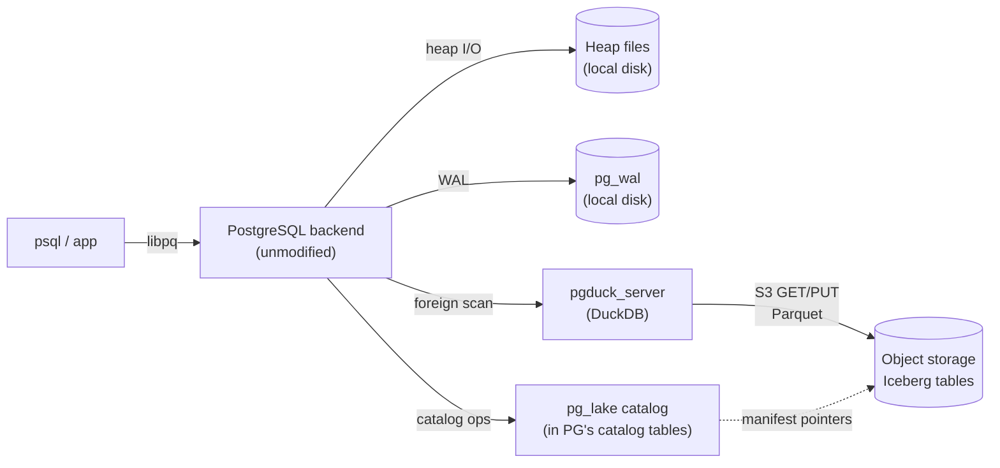
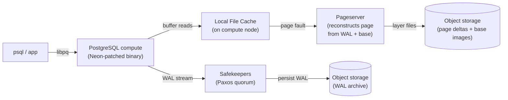

# pg_lake vs Lakebase: Two Very Different Things Called “Postgres + Lakehouse”

Source: [pg_lake vs Lakebase: Two Very Different Things Called “Postgres + Lakehouse”](https://thebuild.com/blog/2026/05/08/pglake-vs-lakebase-two-very-different-things-called-postgres-lakehouse/)  
Category: PostgreSQL

Snowflake and Databricks are now both selling something called PostgreSQL, both pitched at the same general use case (“the operational database next to your lakehouse”), and both with the word “lake” in the product name. Snowflake calls theirs `pg_lake` (a set of open-source extensions, plus the managed Snowflake Postgres service that wraps them). Databricks calls theirs **Lakebase** (a managed service built on the Neon engine they acquired in 2025).

The marketing is similar enough that it is easy to assume the architectures are similar. They are not. They are, in fact, almost opposites — one keeps PostgreSQL exactly the way you know it and grafts a lakehouse access layer onto the side, the other keeps the PostgreSQL programming surface but replaces the storage subsystem entirely. Which one is right for any given workload depends on details that the marketing materials cheerfully do not address.

This post pulls them apart and looks at where the queries actually execute, what survives of PostgreSQL’s transactional model, and where each one stops being PostgreSQL in any meaningful sense.

## The Short Version

`pg_lake` is **PostgreSQL extended outward**. Postgres is still the canonical, unmodified-binary Postgres you know. Heap tables still live in heap files, MVCC still works the way it always has, WAL still goes to local disk. What `pg_lake` adds is the ability to define Iceberg tables — backed by Parquet files in object storage — and to query and write them as if they were native, with PostgreSQL itself acting as the Iceberg catalog. Heavy analytical scans get delegated to a sidecar process running DuckDB.

**Lakebase** is **PostgreSQL with the storage stack replaced**. The compute node is a Postgres binary (with Neon’s patches), but its WAL goes over the network to a quorum of safekeepers, and its pages come from a separate pageserver process that materializes them on demand from WAL plus base images, with object storage as the cold tier. There is no local heap file. There is no `pg_wal` directory in the conventional sense. From the SQL surface, it looks identical to upstream Postgres. From the operational surface, it is something quite different.

You can already see why these are different bets. One says “Postgres should reach into the lakehouse.” The other says “Postgres’s storage should *be* a lakehouse-shaped storage system.”

## pg_lake: Postgres as Iceberg Catalog

The architecture, simplified:

The components, in plain terms:

- The **PostgreSQL backend** is exactly what you’d run today. Same binary, same `postgresql.conf`, same MVCC, same WAL, same everything. Heap tables, B-tree indexes, GIN, GiST — all unchanged.
- The **pg_lake extension family** is a stack of about a dozen extensions: `pg_lake_table` (a foreign data wrapper for lake files), `pg_lake_iceberg` (Iceberg-specific metadata handling), `pg_lake_engine` (shared internals), `pg_extension_base` (a foundation layer), and helpers like `pg_map`, `pg_extension_updater`, plus optional `pg_lake_spatial` (PostGIS-aware) and `pg_lake_benchmark`.
- **Postgres itself is the Iceberg catalog.** This is the most interesting design decision in the whole thing. The Iceberg specification expects an external catalog (Hive Metastore, AWS Glue, the REST catalog, Polaris, Unity Catalog) — `pg_lake` makes Postgres play that role, storing snapshot pointers and manifest references in regular Postgres catalog tables. CREATE TABLE on an Iceberg table writes to PG’s catalog; the manifest in object storage gets updated; the whole thing happens inside a Postgres transaction.
- **`pgduck_server`** is the bit that does the actual analytical heavy lifting. It is a separate, multi-threaded process that speaks the PostgreSQL wire protocol on a Unix socket (or port 5332) and underneath uses DuckDB as the columnar execution engine. When the Postgres planner recognizes that a query is hitting an Iceberg-backed foreign table — particularly one that benefits from columnar scan, predicate pushdown, and parallel S3 reads — it delegates that scan to `pgduck_server`, which fetches the relevant Parquet files and returns rows.

What you get out of this:

- **Heap tables still behave like heap tables.** OLTP traffic is unaffected. Your latency-sensitive `INSERT ... ON CONFLICT` is doing exactly what it did yesterday.
- **Iceberg tables behave like a foreign data wrapper.** They are queryable from PG SQL with full JOINs against your heap tables. Predicate pushdown is real. Updates and deletes against Iceberg tables exist, but they go through Iceberg’s copy-on-write semantics — there is no MVCC on those rows in the PG sense.
- **Cross-tool interoperability is the headline feature.** Because the data lives in standard Iceberg + Parquet on object storage, Spark, Trino, Athena, DuckDB-standalone, ClickHouse, and anything else that reads Iceberg can read the same data. PG is the catalog and a query engine, but it is not the storage of record for those tables.

The transactional story is more nuanced than the marketing suggests. A transaction that touches both a heap table and an Iceberg table is *not* fully ACID across the boundary. The heap-side changes are MVCC-protected with full PostgreSQL semantics. The Iceberg-side changes are committed when the manifest pointer is updated, and the rules for visibility on the Iceberg side are Iceberg’s — snapshot isolation against the table-level snapshot, not row-level MVCC. For most analytical workloads this is fine. For workloads where you actually need the two sides to fail or commit together with strict guarantees, read the documentation carefully and test the failure modes before you build on it.

The PG-compatibility footprint of `pg_lake` is essentially “all of Postgres, plus a foreign data wrapper that understands Iceberg.” If you can run extensions, you can run `pg_lake`. The Snowflake Postgres managed service runs the same code, with the additional commercial features around the catalog, governance, and the bundled `pgduck_server` deployment.

## Lakebase: Postgres Without the Storage You Knew

The architecture, simplified:

The components, in plain terms:

- The **compute node** is a real PostgreSQL backend. It parses SQL, plans queries, executes them, manages MVCC, takes locks, owns its `shared_buffers`. It is patched relative to upstream — the changes are mostly around what happens at the storage manager (`smgr`) layer — but the SQL surface is identical. Extensions install. `pg_stat_statements` works. `pg_dump` works.
- The **Local File Cache (LFC)** is an additional cache that sits between `shared_buffers` and the pageserver. Conceptually: shared buffers are the hot working set, LFC is the warm working set, the pageserver is the source of truth. Tuning the LFC is where a lot of Lakebase’s perceived performance comes from.
- The **safekeepers** are a Paxos-style quorum. The compute node, instead of writing WAL to a local `pg_wal` directory and `fsync()`-ing it, sends WAL records over the network. A transaction is durable when a quorum of safekeepers has acknowledged the WAL record. Three safekeepers is typical; commit acknowledgment requires two of three.
- The **pageserver** is the most novel piece. It does not store pages directly. It stores layered WAL — base images plus deltas — and on a page request from the compute node, it materializes the requested page at the requested LSN and ships it back. Layer files spill out to object storage as cold tier. Hot pages stay on the pageserver’s local disk.

What you get out of this:

- **Compute is stateless.** The compute node has no durable local state of value. You can kill it, restart it, scale it to zero, scale it back from zero, or run it on a different host, and as long as it can talk to the safekeepers and the pageserver, it picks up where it left off. This is the architectural basis for “scale to zero” and for the sub-second branching that Neon is famous for.
- **Storage is bottomless.** Object storage is the durable substrate; you do not provision a disk size. Pricing follows usage rather than allocation.
- **Branches are copy-on-write.** Because pages are reconstructed from WAL on demand, creating a branch at LSN N is a metadata operation. The branch starts out reading the same layer files as its parent, and only diverges as new WAL is written.
- **Replication semantics are Neon-specific.** There is no archive_command, no `pg_basebackup` from compute, no streaming replica in the traditional sense. The replication primitives are different. They exist, but they are not the ones in the PostgreSQL administration manual.

What survives, and what doesn’t:

- **MVCC is unchanged.** Visibility, snapshots, locking, deadlock detection, vacuum — all upstream Postgres behavior.
- **Extension compatibility is high but not total.** Anything that does its work above the buffer manager works fine. Anything that pokes at the WAL stream, makes assumptions about local files, or relies on background workers writing to disk paths needs to be checked. Most production extensions you actually use — `pgvector`, `pg_stat_statements`, `pgaudit`, PostGIS, `pg_partman` — work without modification. A few specialized ones do not.
- **Vacuum still matters.** This is the one most people get wrong. Even though the storage is bottomless and old layer files get garbage-collected on the pageserver, dead tuples in PG’s heap files still consume buffer space and affect query plans. `VACUUM` and autovacuum still need to run, and their tuning is still a real concern. The shape of the I/O it generates is different (reads come back from a network pageserver rather than a local SSD), but the workload it generates is the same.
- **`fsync` semantics are the safekeeper round-trip.** The latency floor for a commit is the network latency to the safekeeper quorum plus the safekeeper’s local fsync. In a single-AZ deployment this is fast. In a deliberately multi-AZ-quorum deployment it is not, and your `commit_delay` / batching strategy matters more than it does on local disk.
- **`pg_wal` is gone.** Or rather, it never wrote anything to disk locally. Tools that scrape the WAL directory, monitor archive lag the old way, or rely on `pg_basebackup` against the compute node need different plumbing.

In Databricks Lakebase, this engine sits next to Unity Catalog and the Databricks lakehouse. The integration story is that operational data in Lakebase can be exposed to the lakehouse via Delta Sharing or Unity Catalog federation, but **Lakebase storage itself is not Iceberg or Delta**. The compute node reads from the Neon pageserver, not from object storage directly, and the on-disk format is internal. If you want to query Lakebase data with Spark or Trino directly, you do that through Unity Catalog federation, not by pointing those engines at the underlying object storage.

## Where Each One Stops Being PostgreSQL

This is the question the marketing answers least helpfully.

**`pg_lake` stops being PostgreSQL at the foreign data wrapper boundary.** Heap tables are real PG; Iceberg tables are not, and they have Iceberg’s semantics, not PG’s. Cross-table transactions across the heap/Iceberg boundary are best-effort, not strictly atomic. The DuckDB sidecar’s behavior is closer to “another Postgres-compatible database” than to “a faster execution path inside Postgres” — when planner choices cross between PG and `pgduck_server`, you are crossing a process boundary. None of this is fatal. All of it is real.

**Lakebase stops being PostgreSQL at the storage manager.** The SQL is identical, the MVCC model is identical, but everything below the buffer manager is different code. Operations playbooks written for upstream PostgreSQL — physical replication tuning, `pg_basebackup`-based DR, traditional `pg_wal`/archive_command/restore_command flows, low-level filesystem-level backups — do not apply. Replacements exist, but they are Neon’s, not Postgres’s. Extensions that rely on the storage manager’s exact behavior need verification.

For the working DBA, the practical mental model is:

- **Choose `pg_lake`** when your bottleneck is “I need analytical access to data that lives in the lakehouse, with full PostgreSQL on top.” You keep all of operational PostgreSQL, including every operational tool you already own, and you get a clean path into Iceberg.
- **Choose Lakebase** when your bottleneck is “I want a managed serverless OLTP Postgres that scales to zero, branches in milliseconds, and integrates with Unity Catalog.” You keep the SQL surface but you give up direct ownership of the storage stack, and you accept that the operational toolkit is not the one you have always used.

These are different bets. Calling both of them “PostgreSQL + lakehouse” is true at a high enough level of abstraction to be misleading at every lower level. Build mental models for them separately. If you are doing an architecture review where one or both is on the table, the worst thing you can do is treat them as interchangeable just because they share the word “Postgres” in the marketing.
