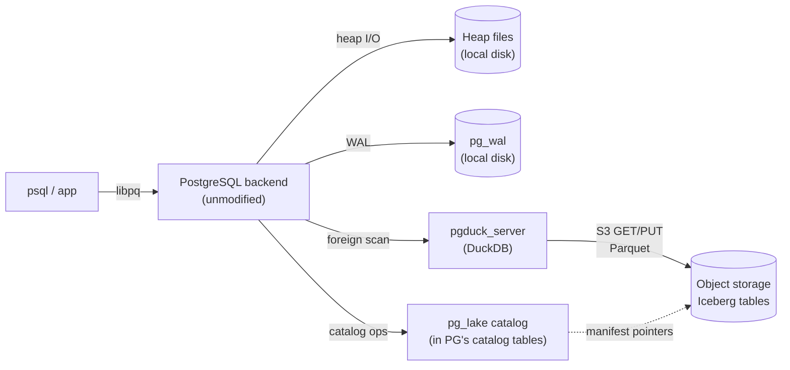
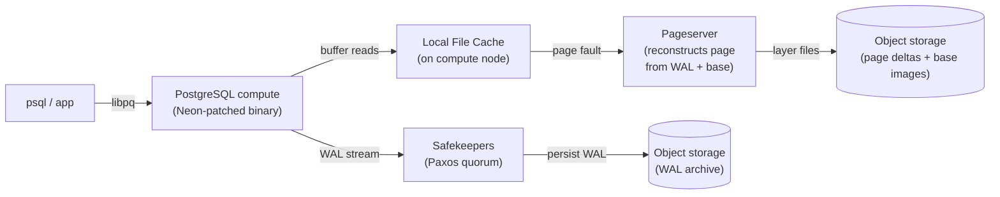

# pg_lake vs Lakebase：两个非常不同、却都被称为“Postgres + Lakehouse”的东西

来源: [pg_lake vs Lakebase: Two Very Different Things Called “Postgres + Lakehouse”](https://thebuild.com/blog/2026/05/08/pglake-vs-lakebase-two-very-different-things-called-postgres-lakehouse/)  
分类: PostgreSQL

Snowflake 和 Databricks 现在都在销售某种叫做 PostgreSQL 的东西，两者都面向同一个大致用例（“位于你的 lakehouse 旁边的 operational database”），并且产品名称里都带有“lake”这个词。Snowflake 称其为 `pg_lake`（一组开源扩展，加上包装它们的托管 Snowflake Postgres 服务）。Databricks 称其为 **Lakebase**（一个基于他们在 2025 年收购的 Neon 引擎构建的托管服务）。

它们的营销说法足够相似，很容易让人以为架构也相似。但事实并非如此。实际上，它们几乎是相反的——一个保持 PostgreSQL 完全是你熟悉的样子，并在侧面嫁接一个 lakehouse 访问层；另一个保留 PostgreSQL 的编程界面，但完全替换存储子系统。哪一个适合某个给定工作负载，取决于营销材料愉快地没有涉及的细节。

本文将把它们拆开来看：查询实际上在哪里执行，PostgreSQL 的事务模型还剩下什么，以及各自在哪些地方不再具有任何有意义的 PostgreSQL 属性。

## 简短版本

`pg_lake` 是**向外扩展的 PostgreSQL**。Postgres 仍然是你熟悉的规范、未修改二进制的 Postgres。堆表仍然存在于堆文件中，MVCC 仍然以一直以来的方式工作，WAL 仍然写入本地磁盘。`pg_lake` 添加的是定义 Iceberg 表的能力——这些表由对象存储中的 Parquet 文件支撑——并且能够像原生表一样查询和写入它们，由 PostgreSQL 自身充当 Iceberg catalog。繁重的分析扫描会被委托给一个运行 DuckDB 的 sidecar 进程。

**Lakebase** 是**替换了存储栈的 PostgreSQL**。计算节点是一个 Postgres 二进制（带有 Neon 的补丁），但它的 WAL 会通过网络发送到一组 safekeepers quorum，它的页面来自单独的 pageserver 进程，后者按需从 WAL 加 base images 中物化页面，并以对象存储作为冷层。没有本地堆文件。没有传统意义上的 `pg_wal` 目录。从 SQL 表面看，它与 upstream Postgres 完全相同。从运维表面看，它是相当不同的东西。

你已经可以看出这是两种不同的押注。一个说“Postgres 应该伸入 lakehouse”。另一个说“Postgres 的存储应该*成为*一种 lakehouse 形态的存储系统”。

## pg_lake：Postgres 作为 Iceberg Catalog

架构，简化如下：

这些组件，用普通话说：

- **PostgreSQL backend** 正是你今天会运行的东西。同一个二进制，同一个 `postgresql.conf`，同一个 MVCC，同一个 WAL，一切都相同。堆表、B-tree 索引、GIN、GiST——全部不变。
- **pg_lake 扩展族** 是一组大约十几个扩展的栈：`pg_lake_table`（用于 lake 文件的 foreign data wrapper）、`pg_lake_iceberg`（Iceberg 特定的元数据处理）、`pg_lake_engine`（共享内部机制）、`pg_extension_base`（基础层），以及 `pg_map`、`pg_extension_updater` 这类辅助扩展，再加上可选的 `pg_lake_spatial`（感知 PostGIS）和 `pg_lake_benchmark`。
- **Postgres 自身就是 Iceberg catalog。** 这是整个设计中最有趣的决策。Iceberg 规范预期存在一个外部 catalog（Hive Metastore、AWS Glue、REST catalog、Polaris、Unity Catalog）——`pg_lake` 让 Postgres 扮演这个角色，在普通 Postgres catalog 表中存储 snapshot 指针和 manifest 引用。对 Iceberg 表执行 CREATE TABLE 会写入 PG 的 catalog；对象存储中的 manifest 会被更新；整个事情发生在一个 Postgres 事务内部。
- **`pgduck_server`** 是执行实际分析重活的部分。它是一个独立的、多线程的进程，通过 Unix socket（或端口 5332）讲 PostgreSQL wire protocol，底层使用 DuckDB 作为列式执行引擎。当 Postgres planner 识别到某个查询正在命中一个 Iceberg 支撑的外部表——尤其是受益于列式扫描、谓词下推和并行 S3 读取的查询——它会把该扫描委托给 `pgduck_server`，后者获取相关 Parquet 文件并返回行。

你由此得到的是：

- **堆表仍然像堆表一样行为。** OLTP 流量不受影响。你的延迟敏感型 `INSERT ... ON CONFLICT` 做的仍然和昨天完全一样。
- **Iceberg 表像 foreign data wrapper 一样行为。** 可以从 PG SQL 查询它们，并与你的堆表做完整 JOIN。谓词下推是真实存在的。针对 Iceberg 表的 update 和 delete 存在，但它们通过 Iceberg 的 copy-on-write 语义实现——这些行在 PG 意义上没有 MVCC。
- **跨工具互操作性是头条特性。** 因为数据以标准 Iceberg + Parquet 形式存在于对象存储中，Spark、Trino、Athena、独立 DuckDB、ClickHouse，以及任何其他能读取 Iceberg 的东西都可以读取同一份数据。PG 是 catalog 和一个查询引擎，但不是这些表的记录存储。

事务故事比营销暗示的更微妙。一个同时触及堆表和 Iceberg 表的事务，*并不*在边界两侧完全 ACID。堆侧变更受到 MVCC 保护，具备完整 PostgreSQL 语义。Iceberg 侧变更在 manifest 指针更新时提交，而 Iceberg 侧的可见性规则是 Iceberg 的——针对表级 snapshot 的 snapshot isolation，而不是行级 MVCC。对大多数分析工作负载来说这没问题。对于真正需要两侧以严格保证一起失败或一起提交的工作负载，在其上构建之前请仔细阅读文档并测试失败模式。

`pg_lake` 的 PG 兼容性足迹本质上是“完整的 Postgres，加上一个理解 Iceberg 的 foreign data wrapper”。如果你能运行扩展，你就能运行 `pg_lake`。Snowflake Postgres 托管服务运行相同代码，并增加围绕 catalog、治理和捆绑 `pgduck_server` 部署的商业功能。

## Lakebase：没有你所熟悉存储的 Postgres

架构，简化如下：

这些组件，用普通话说：

- **compute node** 是一个真实的 PostgreSQL backend。它解析 SQL、规划查询、执行查询、管理 MVCC、获取锁、拥有自己的 `shared_buffers`。相对于 upstream 它打了补丁——变化主要围绕 storage manager（`smgr`）层发生什么——但 SQL 表面是相同的。扩展可以安装。`pg_stat_statements` 可以工作。`pg_dump` 可以工作。
- **Local File Cache (LFC)** 是位于 `shared_buffers` 和 pageserver 之间的额外缓存。概念上：shared buffers 是热工作集，LFC 是温工作集，pageserver 是事实来源。调优 LFC 是 Lakebase 很多感知性能的来源。
- **safekeepers** 是一种 Paxos 风格的 quorum。计算节点不是把 WAL 写入本地 `pg_wal` 目录并对其执行 `fsync()`，而是通过网络发送 WAL 记录。当 safekeepers 的 quorum 已经确认 WAL 记录时，事务才是持久的。三个 safekeepers 是典型配置；提交确认需要三者中的两个。
- **pageserver** 是最具新意的部分。它不直接存储页面。它存储分层 WAL——base images 加 deltas——并且在计算节点请求某个页面时，将请求 LSN 上的页面物化出来并发回。layer files 会溢出到对象存储作为冷层。热页面保留在 pageserver 的本地磁盘上。

你由此得到的是：

- **计算是无状态的。** 计算节点没有有价值的持久本地状态。你可以杀掉它、重启它、把它缩放到零、从零缩放回来，或者在不同主机上运行它；只要它能和 safekeepers 以及 pageserver 通信，它就会从停止的地方继续。这是“scale to zero”和 Neon 著名的亚秒级 branching 的架构基础。
- **存储是无底的。** 对象存储是持久底座；你不需要预配置磁盘大小。定价按使用量而不是分配量。
- **分支是 copy-on-write 的。** 因为页面按需从 WAL 重建，在 LSN N 创建分支是一个元数据操作。分支一开始读取与其父分支相同的 layer files，只有在写入新的 WAL 时才开始分化。
- **复制语义是 Neon 特定的。** 没有 archive_command，没有来自 compute 的 `pg_basebackup`，没有传统意义上的 streaming replica。复制原语不同。它们存在，但不是 PostgreSQL 管理手册中的那些。

什么保留下来，什么没有：

- **MVCC 不变。** 可见性、snapshots、锁、死锁检测、vacuum——全部是 upstream Postgres 行为。
- **扩展兼容性很高，但并非完全。** 任何在 buffer manager 之上工作的扩展都没问题。任何拨弄 WAL stream、对本地文件做假设，或依赖后台 worker 写入磁盘路径的扩展都需要检查。你实际使用的大多数生产扩展——`pgvector`、`pg_stat_statements`、`pgaudit`、PostGIS、`pg_partman`——无需修改即可工作。少数专门化扩展不能。
- **Vacuum 仍然重要。** 这是大多数人搞错的一点。即使存储是无底的，旧 layer files 会在 pageserver 上被垃圾回收，PG 堆文件中的 dead tuples 仍然会消耗 buffer 空间并影响查询计划。`VACUUM` 和 autovacuum 仍然需要运行，它们的调优仍然是真实问题。它产生的 I/O 形态不同（读取来自网络 pageserver，而不是本地 SSD），但它产生的工作负载是相同的。
- **`fsync` 语义是 safekeeper 往返。** 提交的延迟下限是到 safekeeper quorum 的网络延迟加上 safekeeper 的本地 fsync。在单 AZ 部署中这很快。在刻意的多 AZ quorum 部署中则不是，并且你的 `commit_delay` / batching 策略会比在本地磁盘上更重要。
- **`pg_wal` 消失了。** 或者更准确地说，它从未在本地向磁盘写入任何东西。那些抓取 WAL 目录、用旧方式监控 archive lag，或依赖针对计算节点的 `pg_basebackup` 的工具，需要不同的管道。

在 Databricks Lakebase 中，这个引擎位于 Unity Catalog 和 Databricks lakehouse 旁边。其集成故事是，Lakebase 中的 operational data 可以通过 Delta Sharing 或 Unity Catalog federation 暴露给 lakehouse，但 **Lakebase 存储本身不是 Iceberg 或 Delta**。计算节点从 Neon pageserver 读取，而不是直接从对象存储读取，并且磁盘格式是内部格式。如果你想用 Spark 或 Trino 直接查询 Lakebase 数据，你是通过 Unity Catalog federation 做到这一点，而不是把这些引擎指向底层对象存储。

## 各自在哪里不再是 PostgreSQL

这是营销材料最没有帮助地回答的问题。

**`pg_lake` 在 foreign data wrapper 边界处不再是 PostgreSQL。** 堆表是真正的 PG；Iceberg 表不是，它们具有 Iceberg 的语义，而不是 PG 的语义。跨越堆/Iceberg 边界的跨表事务是尽力而为的，不是严格原子的。DuckDB sidecar 的行为更接近“另一个 Postgres 兼容数据库”，而不是“Postgres 内部更快的执行路径”——当 planner 选择在 PG 和 `pgduck_server` 之间跨越时，你正在跨越进程边界。这些都不是致命的。但都是真实的。

**Lakebase 在 storage manager 处不再是 PostgreSQL。** SQL 相同，MVCC 模型相同，但 buffer manager 以下的一切都是不同代码。为 upstream PostgreSQL 编写的运维手册——物理复制调优、基于 `pg_basebackup` 的 DR、传统 `pg_wal`/archive_command/restore_command 流程、底层文件系统级备份——都不适用。替代品存在，但它们属于 Neon，而不是 Postgres。依赖 storage manager 精确行为的扩展需要验证。

对于工作的 DBA，实用的心智模型是：

- **当你的瓶颈是“我需要以完整 PostgreSQL 为上层，分析访问存在于 lakehouse 中的数据”时，选择 `pg_lake`。** 你保留 operational PostgreSQL 的全部内容，包括你已经拥有的每一个运维工具，并获得通往 Iceberg 的干净路径。
- **当你的瓶颈是“我想要一个托管的 serverless OLTP Postgres，它能 scale to zero、毫秒级 branching，并与 Unity Catalog 集成”时，选择 Lakebase。** 你保留 SQL 表面，但放弃对存储栈的直接所有权，并接受运维工具箱不再是你一直使用的那一套。

这是不同的押注。把它们都称为“PostgreSQL + lakehouse”在足够高的抽象层面上是真的，但在每一个更低层面上都足以误导人。分别为它们建立心智模型。如果你正在做架构评审，并且其中一个或两个都摆在桌面上，最糟糕的事情就是仅仅因为它们在营销中共享“Postgres”这个词，就把它们当作可互换的东西。
