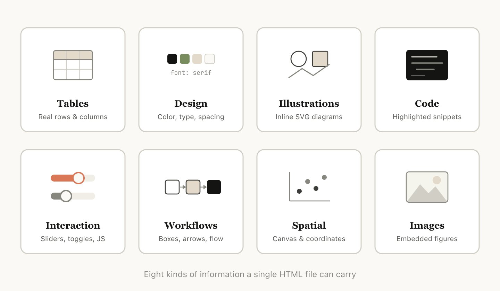
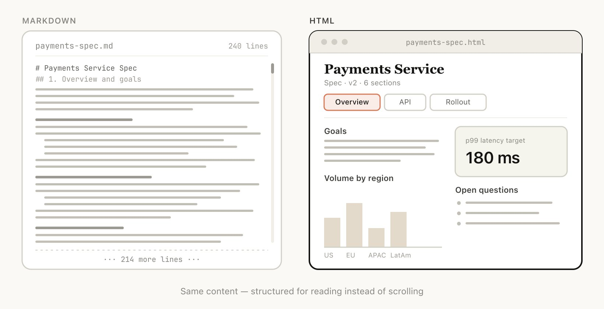
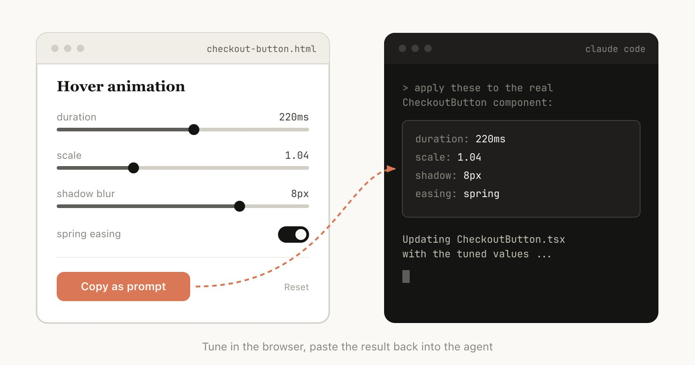
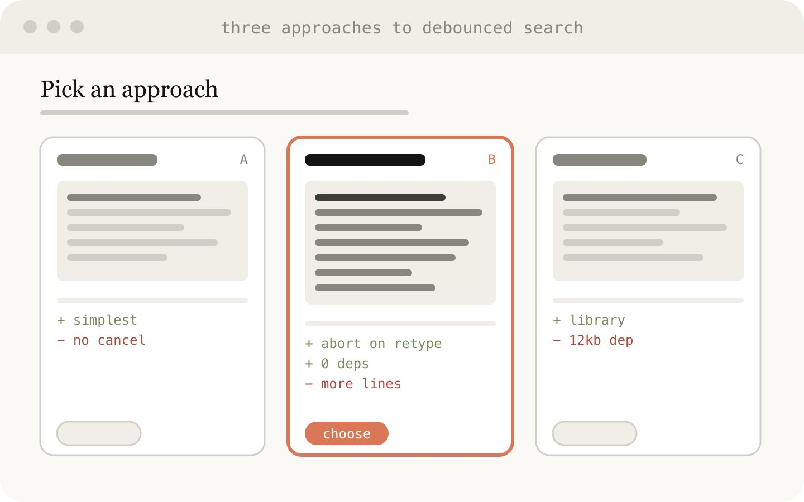
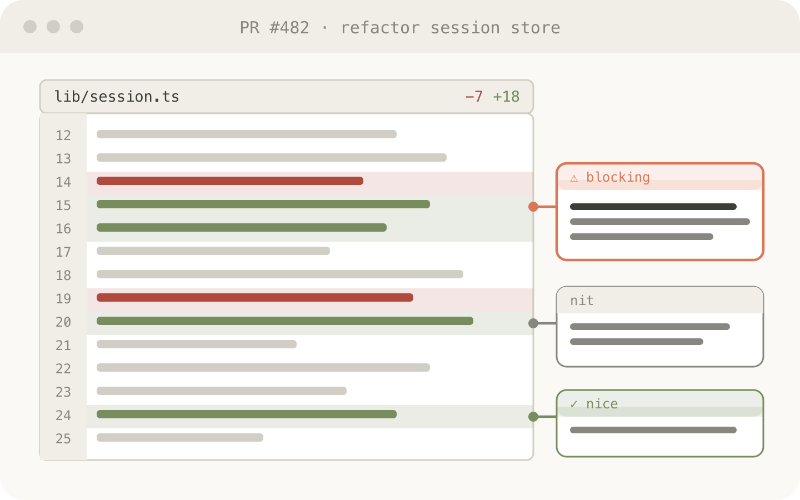
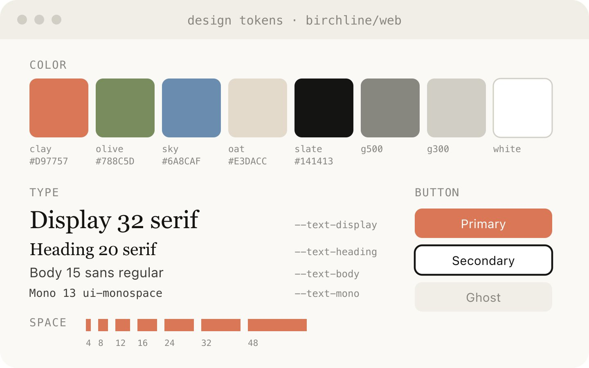
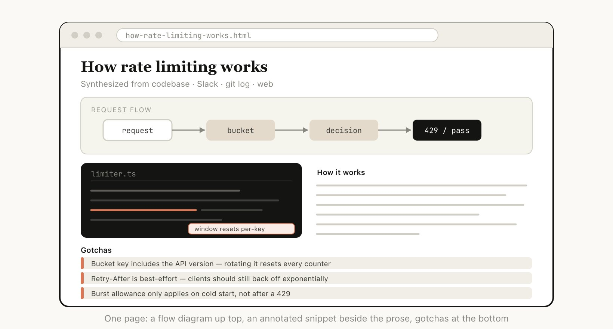
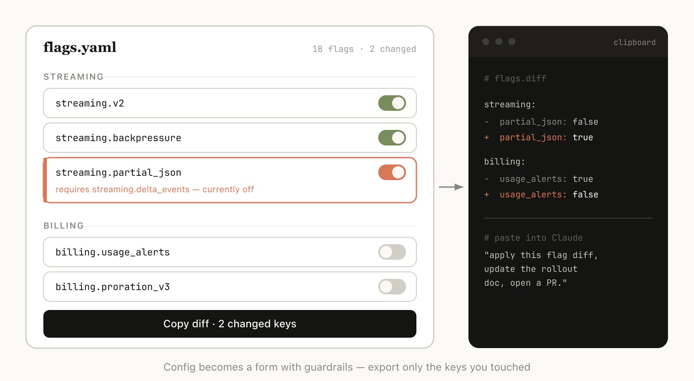

# 使用 Claude Code：HTML 不合常理的有效性

作者: [Thariq (@trq212)](https://x.com/trq212)  
来源: [X / Twitter](https://x.com/trq212/status/2052809885763747935)

Markdown 已经成为 agent 用来与我们沟通的主导文件格式。它简单、可移植，具备一些富文本能力，也很容易由你编辑。Claude 甚至已经出人意料地擅长在 markdown 文件中使用 ASCII 绘制图表。

但随着 agent 变得越来越强大，我感觉 markdown 已经变成一种受限格式。我发现很难阅读超过一百行的 markdown 文件。我想要更丰富的可视化、颜色和图表，并且希望能够轻松分享它们。

我也越来越少亲自编辑这些文件，而是把它们用作 spec、参考文件、头脑风暴输出等。当我确实要做编辑时，通常也是提示 Claude 去编辑它们，这移除了 markdown 最大优势之一。

我已经开始更偏好把 HTML 作为输出格式，而不是 Markdown，并且越来越多地看到 Claude Code 团队中的其他人也在这样使用，原因如下。

（如果你想从一些示例开始，可以在这里看到很多：https://thariqs.github.io/html-effectiveness ，只是一定要回来继续阅读原因）

# 为什么是 HTML？

## 信息密度

与 markdown 相比，HTML 可以传达丰富得多的信息。它当然可以做 headers 和格式化这类简单文档结构，但它也可以表示各种其他信息，例如：

- 使用 tables 表示表格数据
- 使用 CSS 表示设计数据
- 使用 SVG 表示插图
- 使用 script tags 表示代码片段
- 使用 HTML elements 结合 javascript + CSS 实现交互
- 使用 SVG 和 HTML 表示工作流
- 使用绝对定位和 canvases 表示空间数据
- 使用 image tags 表示图片

我甚至会说，几乎不存在 Claude 能读取、但你无法用 HTML 相当高效地表示的信息集合。这使它成为模型向你传达深入信息、以及你审阅这些信息的一种高度高效方式。

我发现，在无法做到这一点时，模型可能会在 markdown 中做一些效率较低的事情，例如 ASCII 图表，或者我最喜欢的：像这张 Claude Code 截图中那样，用 unicode 字符估算颜色。

Claude Code 试图在 markdown 中展示颜色

## 视觉清晰度与易读性

随着 Claude 能够完成更复杂的工作，它也在编写越来越大的 spec 和 plan。实践中，我发现自己往往并不会真正阅读超过 100 行的 markdown 文件，而且我当然也无法让组织里的其他人阅读它。

但 HTML 文档更容易阅读，Claude 可以用视觉方式组织结构，使其非常适合通过 tabs、插图、链接等进行导航。它甚至可以做到移动端响应式，让你根据自己的设备形态以不同方式阅读。

## 易于分享

Markdown 文件相当难分享，因为大多数浏览器并不能很好地原生渲染它们。你通常不得不把它们作为附件添加到邮件或消息中。

使用 HTML 时，只要你上传文件（例如上传到 S3），就可以轻松分享链接。你的同事可以在他们希望的任何地方打开它，并轻松引用它。

如果 spec、报告或 PR writeup 是 HTML 格式，别人真正阅读它的概率会高得多得多。

## 双向交互

HTML 可以让你与文档交互，例如你可能想让它添加 sliders 或 knobs 来调整设计，或者允许你微调算法中的不同选项以查看会发生什么。你还可以要求它让你把这些更改复制成一个 prompt，再粘贴回 Claude Code。

阅读更多关于我的 playgrounds 帖子的内容，查看这种双向交互的示例：https://x.com/trq212/status/2017024445244924382

## 数据摄入

为什么使用 Claude Code 来制作 HTML 文件，而不是例如 ClaudeAI 或 Claude Design？最大的原因之一是 Claude Code 可以摄入的所有上下文。

例如，在写这篇文章时，我让 Claude Code 读遍我的代码文件夹，找到我生成过的所有 HTML 文件，对它们进行分组和分类，然后制作一个包含所有图表的 HTML 文件来表示每种类型。你在这篇文章中看到的图表就是其直接结果。

除了文件系统，Claude Code 还可以使用你的 MCPs（如 Slack、Linear 等）、你的 web browser（通过 Chrome 中的 Claude）、你的 git history 等找到额外上下文。

## 它很快乐

用 Claude 制作 HTML 文档就是更有趣，也让我感觉更参与、更投入于创作，这本身就足够了。

## 如何开始

我有点担心人们读完这篇文章后会把它变成一个 /html skill 或类似东西。虽然那可能有一些价值，但我想强调的是，你不需要做太多就能让 Claude 做到这一点。你只需要要求它“make a HTML file”或“make a HTML artifact”。

诀窍在于知道你希望这个 artifact 做什么，以及你可能如何使用它。随着时间推移你也许会制作一个 skill，但现在我建议从零开始提示，以掌握如何在不同场景中使用它。

# 使用场景

为了让这件事更具体，我为不同用例制作了许多不同的 HTML 文件。你可以在这里查看全部：https://thariqs.github.io/html-effectiveness/ ，下面是概览。

## Specs、规划与探索

HTML 是 Claude 深入问题的丰富画布。当我开始处理一个问题时，我不期望得到一个简单的 markdown plan，而是期望制作一组 HTML 文件。例如，我可能会先让 Claude Code 头脑风暴并创建一些不同选项的探索。然后我会要求它进一步展开其中一个，也许制作 mockups 或代码片段。最后，当我感觉不错时，我会让它编写 implementation plan。当我对计划满意时，我会创建一个新会话，并传入所有这些文件让它实现。

在验证时，我也会要求 verification agent 读入这些文件，这样它会拥有关于所需内容的更广泛上下文。

示例 Prompts：

- I'm not sure what direction to take the onboarding screen. Generate 6 distinctly different approaches — vary layout, tone, and density — and lay them out as a single HTML file in a grid so I can compare them side by side. Label each with the tradeoff it's making.
- Create a thorough implementation plan in a HTML file, be sure to make some mockups, show data flow and add important code snippets I might want to review. Make it easy to read and digest.

使用场景：

- 探索在代码中实现某件事的其他方式
- 探索多个视觉设计

## 代码审查与理解

代码在 Markdown 文件中可能很难阅读。但使用 HTML，我们可以渲染 diffs、annotations、flowcharts、modules 等。用它来理解 agent 编写的代码、获取 code review，或向审查你代码的人解释一个 PR。我发现这通常比默认的 Github diff view 效果更好，而且我现在会给自己创建的每个 PR 附上一个 HTML code explainer。

示例 prompt：

> Help me review this PR by creating an HTML artifact that describes it. I'm not very familiar with the streaming/backpressure logic so focus on that. Render the actual diff with inline margin annotations, color-code findings by severity and whatever else might be needed to convey the concept well.

使用场景：

- 创建 PR
- 审查 PR
- 理解代码中的某个主题

## 设计与原型

Claude Design 基于 HTML，因为 HTML 在设计上极具表达力，即使你的最终表面不是 HTML。Claude 可以用 HTML 草拟设计，然后用你选择的语言编写它，无论是 React、Swift 等。

你还可以原型化交互，例如 animations、actions 等。考虑让 Claude 制作 sliders、knobs 等，以精确调校你正在寻找的东西。

示例 prompt：

> I want to prototype a new checkout button, when clicked it does a play animation and then turns purple quickly. Create a HTML file with several sliders and options for me to try different options on this animation, give me a copy button to copy the parameters that worked well.

用于：

- 创建设计系统 artifacts
- 调整 components
- 可视化 component libraries
- 原型化快乐的 Animations

## 报告、研究与学习

Claude Code 非常擅长跨多个数据源综合信息，并将其转换成可读性强的报告。你可以提示 Claude 搜索你的 Slack、代码库、git history、互联网等，并用它为自己、为领导层、为团队等生成极其易读的报告。

你可以把它组装成长篇 HTML 文档、interactive explainer，甚至 slideshow/deck。要求 Claude 使用 SVG 绘制图表来帮助可视化。

例如，在我关于 prompt caching 的帖子中，我让 Claude 在阅读 git history 之后，为我准备一份深入研究 prompt caching 所有变更的 HTML 文件供我阅读。

示例 prompt：

> I don't understand how our rate limiter actually works. Read the relevant code and produce a single HTML explainer page: a diagram of the token-bucket flow, the 3–4 key code snippets annotated, and a "gotchas" section at the bottom. Optimize it for someone reading it once.

用于：

- 总结一个功能如何工作
- 向我解释一个概念
- 给老板的每周状态报告
- 给领导层的事故报告
- SVG 插图、flowcharts、技术图表等

# 自定义编辑界面

有时很难纯粹在文本框中描述你想要什么。在这种情况下，我会让 Claude 为我构建一个一次性编辑器，专门针对我正在处理的确切内容。不是产品，也不是可复用工具，而是一个单个 HTML 文件，为这一份数据量身定制。

诀窍总是以导出作为结尾：一个 "copy as JSON" 或 "copy as prompt" 按钮，把我在 UI 中做的任何事情转换回可以粘贴到 Claude Code 中的内容。

示例 prompts：

- I need to reprioritize these 30 Linear tickets. Make me an HTML file with each ticket as a draggable card across Now / Next / Later / Cut columns. Pre-sort them by your best guess. Add a "copy as markdown" button that exports the final ordering with a one-line rationale per bucket.
- Here's our feature flag config. Build a form-based editor for it, group flags by area, show dependencies between them, warn me if I enable a flag whose prerequisite is off. Add a "copy diff" button that gives me just the changed keys.
- I'm tuning this system prompt. Make a side-by-side editor: editable prompt on the left with the variable slots highlighted, three sample inputs on the right that re-render the filled template live. Add a character/token counter and a copy button.

用于：

- 对任何东西进行重新排序、分诊或分桶（tickets、test cases、feedback）
- 编辑结构化 config（feature flags、env vars、带约束的 JSON/YAML）
- 调校 prompts、templates 或 copy，并带 live preview
- 策展 datasets、approve/reject rows、tag examples、导出选择结果
- 标注 document、transcript 或 diff，并导出 annotations
- 选择那些用文本表达很痛苦的值：colors、easing curves、crop regions、cron schedules、regexes。

## 常见问题

我一直在告诉很多人我如何切换到 HTML，也看到了一些反复出现的问题。

**它不是更低 token 效率吗？**

虽然 markdown 通常使用更少 tokens，但我发现 HTML 增加的表达力，以及我阅读它的可能性高得多，意味着总体上我会得到更好的输出。借助 Opus 4.7 的 1MM context window，增加的 token 使用量在上下文窗口中并不明显。

**你现在什么时候使用 markdown？**

老实说，我几乎已经完全停止在几乎所有事情上使用 markdown，但我可能站在相当 HTML maximalist 的一边。

**我如何查看 HTML 文件？**

我通常只是在本地浏览器中打开它（你可以让 Claude 打开它），或者如果你想要可分享链接，就上传到 S3。

**这不会比 markdown 生成时间更长吗？**

确实会更长！HTML 可能比 Markdown 长 2-4 倍，但我发现结果值得。

**版本控制怎么办？**

这老实说是 HTML 最大的缺点之一，与 Markdown 相比，HTML diffs 很嘈杂，也很难审查。

**我如何让 Claude 匹配我的品味 / 不要做得难看？**

frontend design plugin 可以帮助 Claude 制作好的 HTML 文件。但如果要匹配你自己公司的风格，你可以通过把 Claude 指向你的代码库，创建一个单一的 design system HTML 文件。然后你可以把那个 design system 文件作为其他 html 文件的参考。

## 保持在回路中

以上所有内容想表达的是，我认为我使用 HTML 的真正原因，是我感觉自己与 Claude 更加保持在回路中。我曾开始担心，因为我已经不再深入阅读计划，我就只能任由 Claude 自己做选择。

但我很高兴地说，使用 HTML 时，我反而比以往任何时候都更感觉自己在回路中。希望你也是如此。
